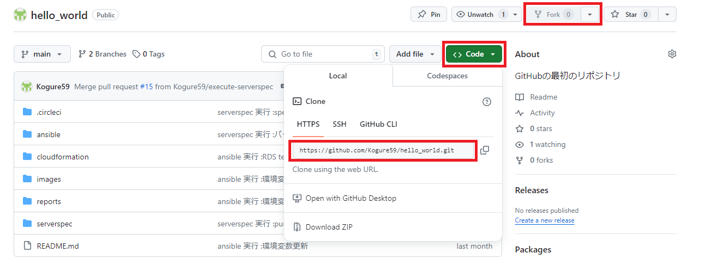
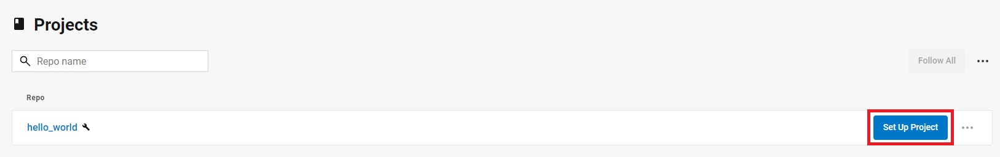
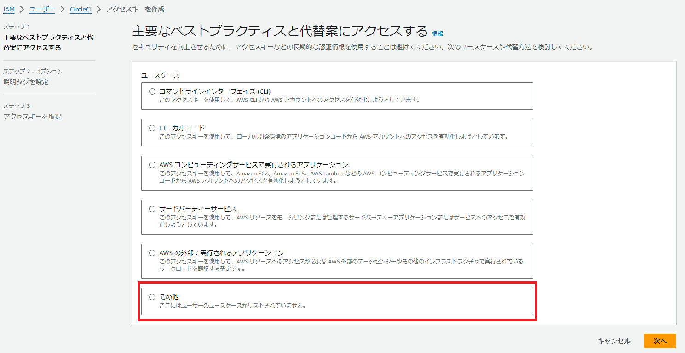
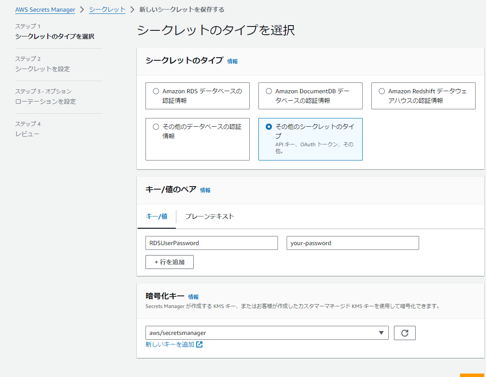
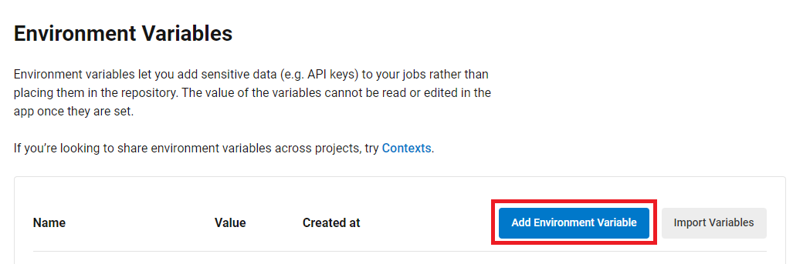
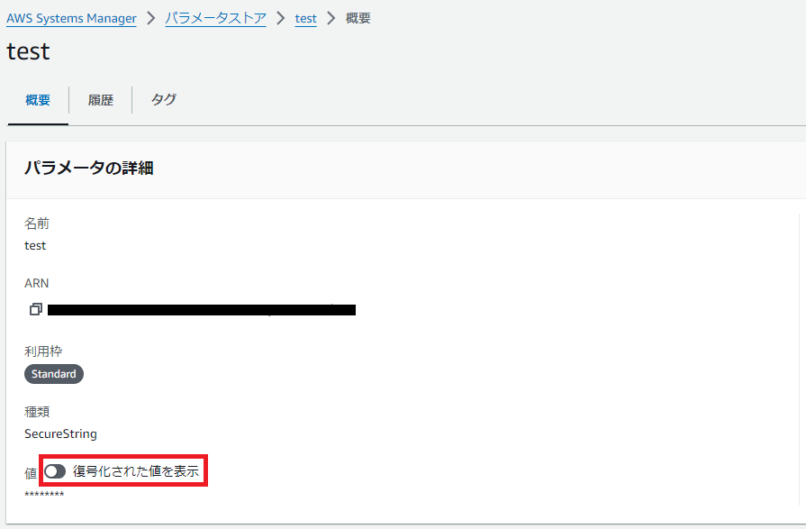
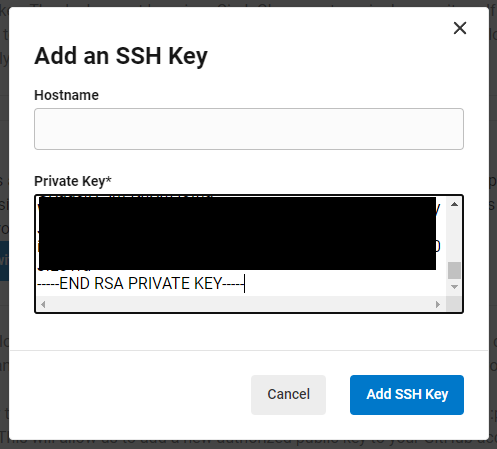
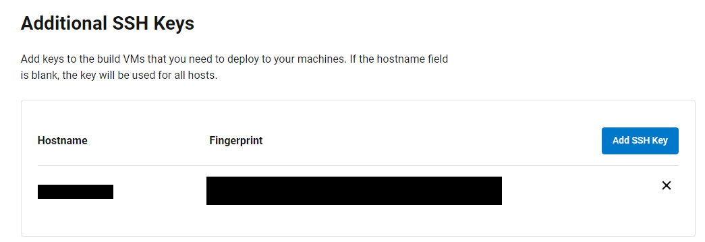
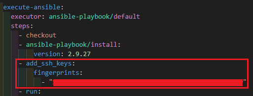

# RaiseTech 課題用リポジトリ
このリポジトリは、 RaiseTech AWS フルコースの課題に取り組むために作成したリポジトリです。
## 目次
- [実践概要](#実践概要)
- [成果物](#成果物)
  * [AWS EC2 上での Rails アプリのデプロイ](#aws-ec2-上での-rails-アプリのデプロイ)
  * [CloudFormation による自動構築](#cloudformation-による自動構築)
  * [CircleCI による CI/CD 環境の構築](#circleci-による-cicd-環境の構築)
- [プロジェクトの作業手順](#プロジェクトの作業手順)
- [学習記録](#学習記録)
  * [RaiseTechの課題](#raisetechの課題)
  * [自主学習](#自主学習)
## 実践概要
### AWS EC2 上で Ruby on Rails のサンプルアプリケーションをデプロイ (手動構築)
- 組み込みサーバ ( Puma ) でデプロイ
- Web サーバ ( Nginx ) + アプリケーションサーバ ( Unicorn ) でデプロイ
- ELB ( ALB ) 、 S3 を追加
- 構築した環境の構成図を作成
### CloudFormation を用いたインフラ環境/リソースの構築
- テンプレートファイルを作成
- 作成したテンプレートファイルからスタックを作成
### CircleCI を用いた CI/CD 環境の構築
  * cfn-lint を実行し、 CloudFormation のテンプレートの検証を自動化する
  * CloudFormation を実行し、環境構築を自動化する
  * Ansible を実行し、プロビジョニングを自動化する
  * ServerSpec を実行し、インフラのテストを自動化する
## 成果物
### AWS EC2 上での Rails アプリのデプロイ 
詳細は下記の md ファイルを参照してください。  
[lecture04.md](reports/lecture04.md) 、 [lecture05.md](reports/lecture05.md)  

手動で下記の図のような環境を構築し、 Rails アプリをデプロイしました。  
EC2 の OS は Amazon Linux 2 、 RDS は MySQL を利用。  
Rails アプリの Web サーバーと AP サーバーは、組み込みサーバーである Puma でのデプロイに加え、 Nginx + Unicorn の構成でのデプロイを実践しました。

### CloudFormation による自動構築
上記と同様の環境を構築しました。  
詳細は [lecture10.md](reports/lecture10.md) を参照してください。  
CloudFormation のコードは [cloudformation](cloudformation) ディレクトリを参照してください。
### CircleCI による CI/CD 環境の構築 
詳細は下記の md ファイルを参照してください。  
[lecture11.md](reports/lecture11.md) 、 [lecture12.md](reports/lecture12.md) 、 [lecture13.md](reports/lecture13.md)

下記の図のように GitHub へのプッシュを CircleCI が検知し、 AWS 環境の構築、アプリデプロイのためのセットアップ、サーバーのテストを自動化しています。  
手動構築をした環境では Nginx + Unicorn の構成でしたが、サンプルアプリケーションのリポジトリにおける Ruby と Rails のバージョンアップが行われたため、 Nginx + Puma の構成で環境を構築しました。  

各ツールのコードは下記のディレクトリを参照してください。  
[.circleci](.circleci) 、 [cloudformation](cloudformation) 、 [ansible](ansible) 、 [serverspec](serverspec)


## プロジェクトの作業手順  
まず、前提として
  - CircleCI のアカウントを所持している
  - CircleCI のアカウントと連携するための GitHub アカウントを所持している
  - AWS アカウントを所持しており、手動での環境の構築が可能である  

これらの条件を満たしている必要があります。
### 作業手順
1. [このリポジトリを CircleCI にセットアップする](#このリポジトリを-circleci-にセットアップする)
2. [CircleCI での CloudFormation 実行を許可するアクセスキーを作成する](#circleci-での-cloudformation-実行を許可するアクセスキーを作成する)
3. [AWS Secrets Manager で RDS のシークレットを作成する](#aws-secrets-manager-で-rds-のシークレットを作成する)
4. [CloudFormation ジョブを実行する](#cloudformation-ジョブを実行する)
5. [CircleCI に SSH Key を追加する](#circleci-に-ssh-key-を追加する)
6. [CircleCI のすべてのジョブを実行する](#circleci-のすべてのジョブを実行する)

#### このリポジトリを CircleCI にセットアップする
  - 画面右上の **Fork** ボタンでリポジトリを Fork します。
  - **Code** ボタンから、 HTTPS のリンクをコピーし、自身のローカル環境へ Clone します。

  - CircleCI に GitHub アカウントでログインし、**Projects** の **Set Up Project** ボタンからセットアップを行います。


#### CircleCI での CloudFormation 実行を許可するアクセスキーを作成する 
  - ポリシー `AdministratorAccess` を持つ IAM ユーザーを作成します。
  - アクセスキー と シークレットアクセスキーを作成します。


#### AWS Secrets Manager で RDS のシークレットを作成する
  - Secrets Manager コンソールを開き、「新しいシークレットを保存する」を押します。
  - 「その他のシークレットのタイプ」を選択し、「キー / 値」の形式を選択します。
  - RDS のテンプレートファイルの設定に合わせて、キーは `RDSUserPassword` 、シークレット名は `lec10-rds-jsonSecrets` とします。 


#### CloudFormation ジョブを実行する
  - CircleCI の **Project Settings** → **Environment Variables** → **Add Environmet Variable** から環境変数を追加します。

    + AWS_ACCESS_KEY_ID ... 手順 2 で作成したアクセスキーです。
    + AWS_SECRET_ACCESS_KEY ... 手順 2 で作成したシークレットアクセスキーです。
    + AWS_DEFAULT_REGION ... CloudFormation を実行するリージョン ( ここでは東京リージョン ) です。
    + MyIP ... EC2 セキュリティグループのインバウンドルール ( Port 22 ) に設定する IP アドレス ( ここではローカル PC の IP アドレス )です。
  - `.circleci/config.yml` の Ansible 、 ServerSpec の設定をコメントアウトし、 CloudFormation までを実行します。

#### CircleCI に SSH Key を追加する
  - AWS Systems Manager のパラメーターストアで、作成されたキーペアの値を取得します。  
「復号化された値を表示」をオンにすることで値が表示されます。

  - CircleCI の **Project Settings** → **SSH Keys** → **Additional SSH Keys** → **Add SSH Keys** へ進み取得したキーペアの値を入力します。 Hostname には作成された Elastic IP アドレスを入力します。 
  

    その後、表示された Fingerprint の値を `.circleci/config.yml` の `add_ssh_keys` ステップで記入します。



#### CircleCI のすべてのジョブを実行する
  - 手順 4 と同様に CircleCI に環境変数を追加します。
    + ElasticIP ... 作成された Elastic IP アドレスです。
    + DB_HOST ... 作成された RDS の エンドポイントです。
    + DB_PASSWORD ... 作成された RDS のパスワードです。手順 3 で作成した**シークレットの値**を設定します。
    + DB_USERNAME ... 作成された RDS のユーザー名です。ここでは `admin` とします。
    + TARGET_HOST ... 作成された EC2 のパブリック IP アドレスです。 ここでは上記 ElasticIP の値と等しくなります。
    + ALB_DNS_NAME ... 作成された ALB の DNS 名です。
    + S3_BUCKET_NAME ... 作成された S3 のバケット名です。
  - Ansible 、 ServerSpec 実行のため、ターゲットのセキュリティグループのインバウンドルールを一時的に変更します。  

    CircleCI でジョブを実行するためには、 ターゲットの Port 22 で CircleCI 実行環境の IP アドレスを許可することが必要になります。  
    しかし、 CircleCI の IP アドレスの使用には料金が発生するため、ここでは Port 22 で 0.0.0.0/0 ( すべての IPv4 ) を一時的に許可し、ジョブ完了後に元の MyIP の値に戻すようにします。
  - `.circleci/config.yml` のコメントアウト ( 手順 4 ) を解除し、実行します。
## 学習記録
### RaiseTechの課題
#### RaiseTechの課題は以下の方針のもと進めていきます
- RaiseTech では現場と同じ依頼の粒度で課題を出す
- 原則、細かい指示はない
- 指示のない部分を考え、積極的に質問することが現場でのベーススキルになる
### AWS フルコースカリキュラムと課題の概要
#### 全16回の講座を受講
1. AWS とは、インフラエンジニアとは 
    * AWS アカウントを作成
    * IAM の推奨設定 ( MFA, Billing, AdministratorAccess )
    * Amazon Linux 2 で作成した Cloud9 で Ruby を使って HelloWorld を出力
2. バージョン管理システム ( [lecture02.md](reports/lecture02.md) )
    * GitHub でリポジトリを作成
    * Cloud9 の Git 設定変更 ( init.defaultBranch / user.name / user.email )
    * 講座の感想を Markdown で書き、プルリクエストを発行
3. Web アプリケーションとは、システム ( アプリケーション ) 開発の流れ、外部ライブラリと構成管理 ( [lecture03.md](reports/lecture03.md) )
    * サンプルアプリケーションの起動
      + サンプルアプリケーションを GitHub からクローン
      + 添付されている README.md の理解
      + デプロイ作業 ( MySQL のインストール、 Bundler による Gem のインストール等 )
      + Web ブラウザでの接続確認
    * AP サーバー、 DB サーバーについて調べる( サーバーの名前・バージョン )
    * 課題から学んだことをまとめる
4. AWS の環境完成のイメージ、 AWS での権限管理 ( [lecture04.md](reports/lecture04.md) )
    * AWS 上に新しく VPC を作成し、 EC2 と RDS を構築
    * EC2 から RDS へ接続し、正常であることを確認
5. EC2 にアプリケーションのデプロイ、 ELB 、 S3 、インフラ構成図 ( [lecture05.md](reports/lecture05.md) )
    * EC2 上に第 3 回課題のサンプルアプリケーションをデプロイ
      + まずは組み込みサーバー ( puma ) だけでデプロイ
      + 動作したらサーバーアプリケーションを分けてデプロイ ( Unicorn + Nginx )
    * ELB の追加
    * S3 の追加
    * 構成図の作成
6. AWS での証跡、ロギング、監視、通知、コスト管理 ( [lecture06.md](reports/lecture06.md) )
    * 最後に AWS を利用した日の記録を CloudTrail のイベントから探し出す
      + 自身の IAM ユーザー名があるもの
      + 見つけたイベントのイベント名と含まれている内容を 3 つピックアップ
    * CloudWatch アラームを使って、 ALB のアラームを設定して、メールを通知する
      + メールには Amazon SNS を使う
      + アラームとアクションを設定した状態で、 Rails アプリケーションが使える・使えない状態それぞれで動作を確認
7. システムにおけるセキュリティの基礎、 AWS でのセキュリティ対策 ( [lecture07.md](reports/lecture07.md) )
    * これまでに作成した環境は、どのような攻撃に対して「脆弱」か、また、どのような対策が取れそうかを考えてまとめる
8. 構築の実演 ( 1 ) 〈※課題は無し〉
9. 構築の実演 ( 2 ) 〈※課題は無し〉
10. インフラ自動化、 CloudFormation ( [lecture10.md](reports/lecture10.md) )
    * CloudFormation を利用して、これまでに作成した環境をコード化する
    * コード化ができたら実行して、環境が自動で作られていることを確認する
11. インフラのコード化を支援するツール、インフラのテストとは ( [lecture11.md](reports/lecture11.md) )
    * ServerSpec のテストが成功することを確認する
      + 提供されるサンプルをカスタマイズする
      + テスト定義には決まった答えはないので、自由な発想で色々試す
12. Terraform、 DevOps 、 CI/CD ツールとは ( [lecture12.md](reports/lecture12.md) )
    * 提供される CircleCI のサンプルコンフィグを、正しく動作するようにリポジトリに組み込む
13. Ansible 、 OpsWorks 、 CircleCI との併用 ( [lecture13.md](reports/lecture13.md) )
    * CircleCI のサンプルに ServerSpec と Ansible の処理を追加する
14. ライブコーディング ( Ansible 〜 CircleCI )
    * これまでの AWS 構成図、自動化処理がわかる図、リポジトリの README を作る
15. ライブコーディング ( Ansible 〜 CircleCI )
    * これまでの AWS 構成図、自動化処理がわかる図、リポジトリの README を作る
16. 現場へ出ていくにあたって必要な技術と知識 〈※課題は無し〉

### 自主学習
### Windows 環境への Ansible の導入
Windows 環境で playbook の構文チェックやドライラン、デバッグを行うために、 Docker を用いて Ansible を導入しました。
- Windows に Docker for Desktop をインストール
- ローカルディレクトリに以下の Dockerfile を配置
    ```Dockerfile
    FROM amazonlinux:2  # ベースイメージとして Amazon Linux 2 を使用
    RUN yum -y install python3 python3-pip      openssh-clients && \  # Python3 、 pip 、 openssh-clients のインストール
        pip3 install ansible==2.9.27 pywinrm && \  # pip を使って特定バージョンの Ansible と pywinrm をインストール
        yum clean all && \  # yum キャッシュをクリア
        mkdir /mydata  # /mydata ディレクトリを作成
    ENV LANG ja_JP.UTF-8  # LANG 環境変数を日本語ロケールに設定
    CMD ["/bin/bash"]  # コンテナ起動時に /bin/bash を実行
    ```
- Dockerコンテナ接続  
  * 構築するイメージのイメージ名は `my-ansible`  
  * playbookやinventoryファイルが配置される `MyData` ディレクトリを `Dockerfileを配置しているディレクトリ` 内に作成
  ```PS
    cd [Dockerfileを配置しているディレクトリ]

    docker build -t my-ansible .  #イメージ構築

    docker run -itd -v /path/to/カレントディレクトリ/MyData:/mydata my-ansible  #コンテナ実行 ( /MyData に /mydata をマウント)

    docker ps  #コンテナIDの確認

    docker exec -it [コンテナID] /bin/bash  #コンテナ接続
  ```
- マウントした /mydata に移動してファイルを作成、実行
    ```PS
    cd /mydata

    touch {playbook.yml,inventory}  #ローカルの /MyData にもファイルが作成され、変更がお互いに反映される。

    ansible-playbook playbook.yml -i inventory --syntax-check
    ansible-playbook playbook.yml -i inventory --check
    ansible-playbook playbook.yml -i inventory -vvv
    ansible-playbook playbook.yml -i inventory 
    ```
