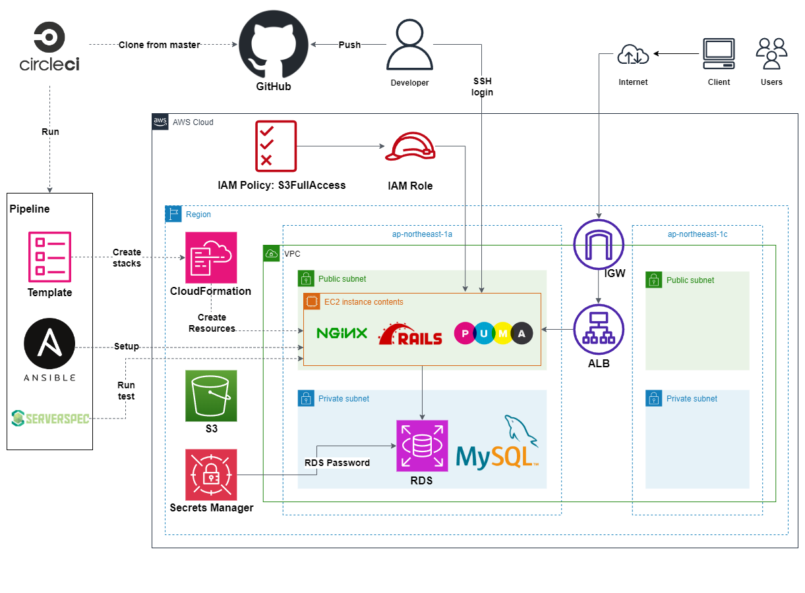

# RaiseTech AWS フルコース
## 実践概要
### EC2 上で Ruby on Rails のサンプルアプリケーションをデプロイ (手動による環境構築)
- 組み込みサーバ ( Puma ) でデプロイ
- Web サーバ ( Nginx ) + アプリケーションサーバ ( Unicorn ) でデプロイ
- ELB ( ALB ) 、 S3 を追加
### CloudFormation を用いたインフラ環境/リソースの構築
- テンプレートファイルを作成
- 作成したテンプレートファイルからスタックを作成
### CircleCI を用いた CI/CD 環境の構築
  * CloudFormation を実行し、 AWS 環境の構築を自動化する
  * Ansible を実行し、構成管理 ( プロビジョニング )、アプリケーションのデプロイメントを自動化する
  * ServerSpec を実行し、インフラのテストを自動化する
## 構成図
#### 最終的に構築された CI/CD 環境の構成図です。 

## 学習記録
| No. | 概要 | 課題 | レポート |  
| :---: | :--- | :--- | :---: |
| 1 | AWS とは、インフラエンジニアとは | <ul><li>AWS アカウントを作成<li>IAM の推奨設定 ( MFA, Billing, AdministratorAccess )<li>Amazon Linux 2 で作成した Cloud9 で Ruby を使って HelloWorld を出力 | - |
| 2 | バージョン管理システム | <ul><li>GitHub でリポジトリを作成<li>Cloud9 の Git 設定変更 ( init.defaultBranch / user.name / user.email )<li>講座の感想を Markdown で書き、プルリクエストを発行 | [lecture02.md](reports/lecture02.md) |
| 3 | Web アプリケーションとは、システム ( アプリケーション ) 開発の流れ、外部ライブラリと構成管理 | <ul><li>サンプルアプリケーションの起動<ul><li>サンプルアプリケーションを GitHub からクローン</li><li>添付されている README.md の理解</li><li>デプロイ作業 (MySQL のインストール、Bundler による Gem のインストール等)</li><li>Web ブラウザでの接続確認</li></ul></li><li>AP サーバー、 DB サーバーについて調べる(サーバーの名前・バージョン)</li><li>課題から学んだことをまとめる</li></ul> | [lecture03.md](reports/lecture03.md) |
| 4 | AWS の環境完成のイメージ、 AWS での権限管理 | <ul><li>AWS 上に新しく VPC を作成し、 EC2 と RDS を構築<li>EC2 から RDS へ接続し、正常であることを確認 | [lecture04.md](reports/lecture04.md) |
| 5 | EC2 にアプリケーションのデプロイ、 ELB 、 S3 、インフラ構成図 | <ul><li>EC2 上に第 3 回課題のサンプルアプリケーションをデプロイ<ul><li>まずは組み込みサーバー ( puma ) だけでデプロイ</li><li>動作したらサーバーアプリケーションを分けてデプロイ ( Unicorn + Nginx )</li></ul></li><li>ELB の追加<li>S3 の追加<li>構成図の作成 | [lecture05.md](reports/lecture05.md) |
| 6 | AWS での証跡、ロギング、監視、通知、コスト管理 | <ul><li>最後に AWS を利用した日の記録を CloudTrail のイベントから探し出す<ul><li>自身の IAM ユーザー名があるもの</li><li>見つけたイベントのイベント名と含まれている内容を 3 つピックアップ</li></ul></li><li>CloudWatch アラームを使って、 ALB のアラームを設定して、メールを通知する<ul><li>メールには Amazon SNS を使う</li><li>アラームとアクションを設定した状態で、 Rails アプリケーションが使える・使えない状態それぞれで動作を確認 | [lecture06.md](reports/lecture06.md) |
| 7 | システムにおけるセキュリティの基礎、 AWS でのセキュリティ対策 | <ul><li>これまでに作成した環境は、どのような攻撃に対して「脆弱」か、また、どのような対策が取れそうかを考えてまとめる | [lecture07.md](reports/lecture07.md) |
| 8 | 構築の実演 ( 1 ) | 
- | - |
| 9 | 構築の実演 ( 2 ) | 
- | - |
| 10 | インフラ自動化、 CloudFormation | <ul><li>CloudFormation を利用して、これまでに作成した環境をコード化する<li>コード化ができたら実行して、環境が自動で作られていることを確認する | [lecture10.md](reports/lecture10.md) |
| 11 | インフラのコード化を支援するツール、インフラのテストとは | <ul><li>ServerSpec のテストが成功することを確認する<ul><li>提供されるサンプルをカスタマイズする<li>テスト定義には決まった答えはないので、自由な発想で色々試す | [lecture11.md](reports/lecture11.md) |
| 12 | Terraform、 DevOps 、 CI/CD ツールとは | <ul><li>提供される CircleCI のサンプルコンフィグを、正しく動作するようにリポジトリに組み込む | [lecture12.md](reports/lecture12.md) |
| 13 | Ansible 、 OpsWorks 、 CircleCI との併用 | <ul><li>CircleCI のサンプルに ServerSpec と Ansible の処理を追加する | [lecture13.md](reports/lecture13.md) |
| 14 | ライブコーディング ( Ansible 〜 CircleCI ) | <ul><li>これまでの AWS 構成図、自動化処理がわかる図、リポジトリの README を作る | - |
| 15 | ライブコーディング ( Ansible 〜 CircleCI ) | <ul><li>これまでの AWS 構成図、自動化処理がわかる図、リポジトリの README を作る | - |
| 16 | 現場へ出ていくにあたって必要な技術と知識、現場での立ち振る舞い | 
- | - |