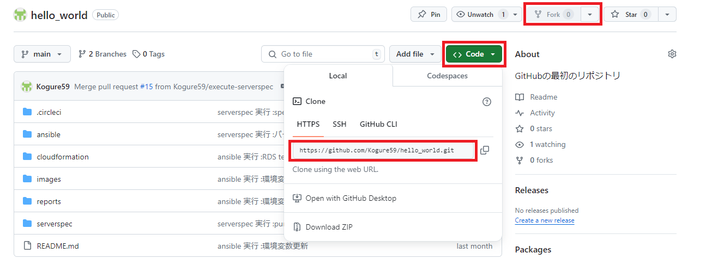
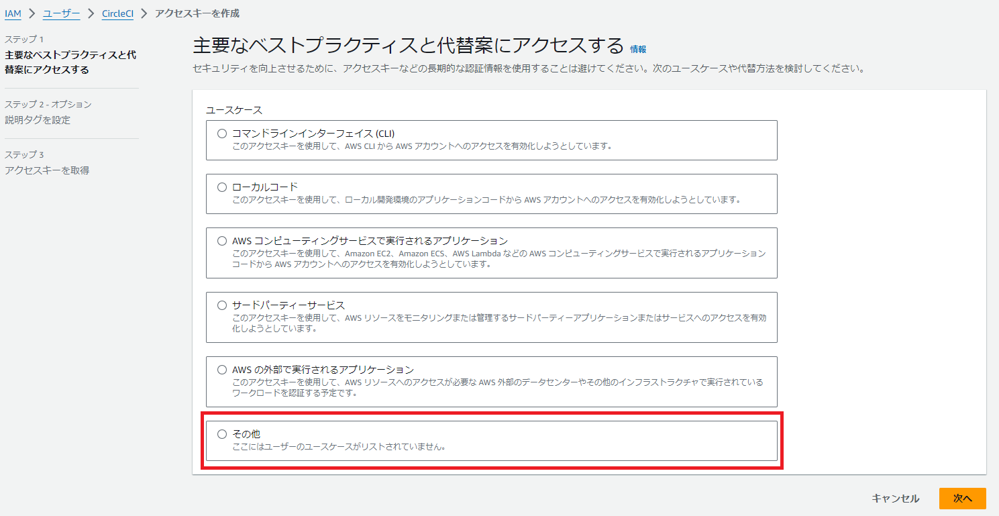
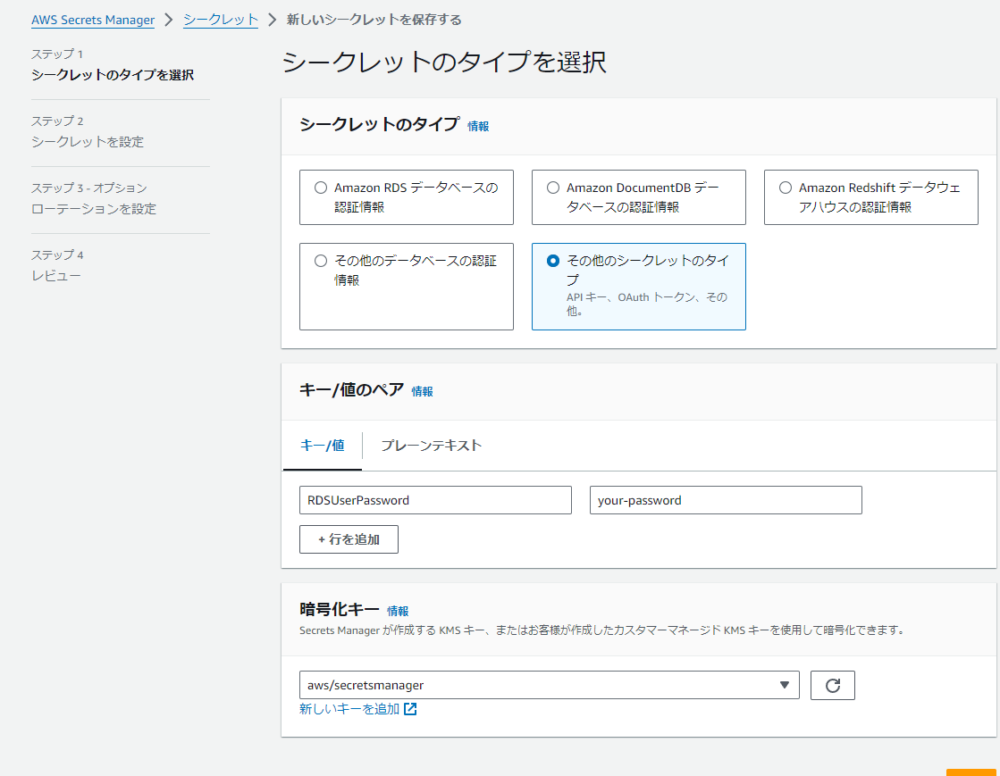
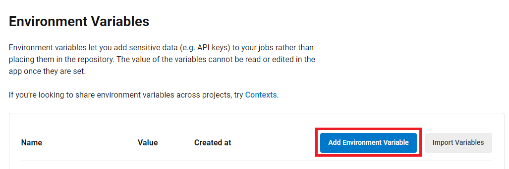
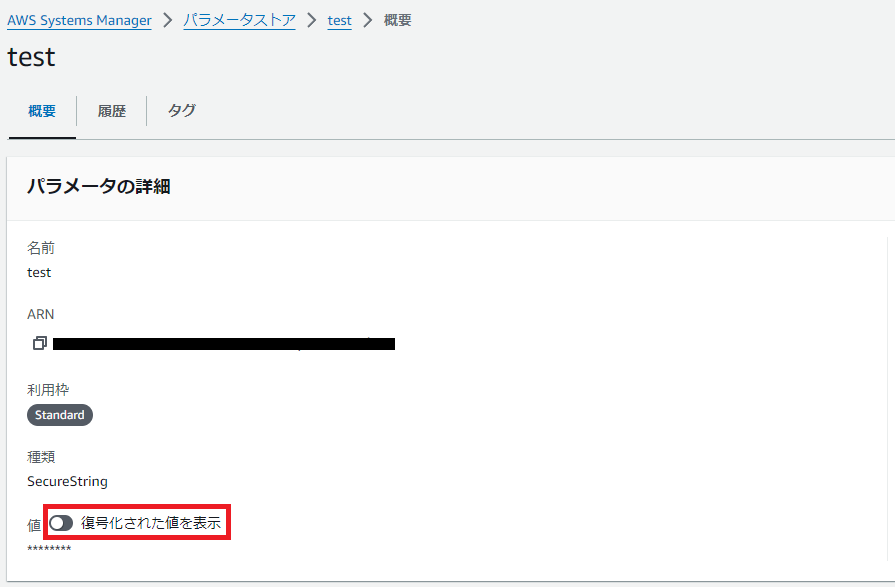
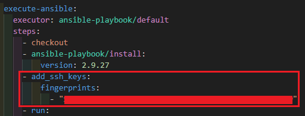

# プロジェクトの作業手順  
まず、前提として
  - CircleCI のアカウントを所持している
  - CircleCI のアカウントと連携するための GitHub アカウントを所持している
  - AWS アカウントを所持しており、手動での環境の構築が可能である  

これらの条件を満たしている必要があります。
## 作業手順
1. [このリポジトリを CircleCI にセットアップする](#このリポジトリを-circleci-にセットアップする)
2. [CircleCI での CloudFormation 実行を許可するアクセスキーを作成する](#circleci-での-cloudformation-実行を許可するアクセスキーを作成する)
3. [AWS Secrets Manager で RDS のシークレットを作成する](#aws-secrets-manager-で-rds-のシークレットを作成する)
4. [CloudFormation ジョブを実行する](#cloudformation-ジョブを実行する)
5. [CircleCI に SSH Key を追加する](#circleci-に-ssh-key-を追加する)
6. [CircleCI のすべてのジョブを実行する](#circleci-のすべてのジョブを実行する)

### このリポジトリを CircleCI にセットアップする
  - 画面右上の **Fork** ボタンでリポジトリを Fork します。
  - **Code** ボタンから、 HTTPS のリンクをコピーし、自身のローカル環境へ Clone します。

  - CircleCI に GitHub アカウントでログインし、**Projects** の **Set Up Project** ボタンからセットアップを行います。

### CircleCI での CloudFormation 実行を許可するアクセスキーを作成する 
  - ポリシー `AdministratorAccess` を持つ IAM ユーザーを作成します。
  - アクセスキー と シークレットアクセスキーを作成します。

### AWS Secrets Manager で RDS のシークレットを作成する
  - Secrets Manager コンソールを開き、「新しいシークレットを保存する」を押します。
  - 「その他のシークレットのタイプ」を選択し、「キー / 値」の形式を選択します。
  - RDS のテンプレートファイルの設定に合わせて、キーは `RDSUserPassword` 、シークレット名は `lec10-rds-jsonSecrets` とします。 

### CloudFormation ジョブを実行する
  - CircleCI の **Project Settings** → **Environment Variables** → **Add Environmet Variable** から環境変数を追加します。

    + AWS_ACCESS_KEY_ID ... 手順 2 で作成したアクセスキーです。
    + AWS_SECRET_ACCESS_KEY ... 手順 2 で作成したシークレットアクセスキーです。
    + AWS_DEFAULT_REGION ... CloudFormation を実行するリージョン ( ここでは東京リージョン ) です。
    + MyIP ... EC2 セキュリティグループのインバウンドルール ( Port 22 ) に設定する IP アドレス ( ここではローカル PC の IP アドレス )です。
  - `.circleci/config.yml` の Ansible 、 ServerSpec の設定をコメントアウトし、 CloudFormation までを実行します。

### CircleCI に SSH Key を追加する
  - AWS Systems Manager のパラメーターストアで、作成されたキーペアの値を取得します。  
「復号化された値を表示」をオンにすることで値が表示されます。

  - CircleCI の **Project Settings** → **SSH Keys** → **Additional SSH Keys** → **Add SSH Keys** へ進み取得したキーペアの値を入力します。   
  Hostname には作成された Elastic IP アドレスを入力します。  
  
  - 表示された Fingerprint の値を `.circleci/config.yml` の `add_ssh_keys` ステップで記入します。

### CircleCI のすべてのジョブを実行する
  - 手順 4 と同様に CircleCI に環境変数を追加します。
    + ElasticIP ... 作成された Elastic IP アドレスです。
    + DB_HOST ... 作成された RDS の エンドポイントです。
    + DB_PASSWORD ... 作成された RDS のパスワードです。手順 3 で作成した**シークレットの値**を設定します。
    + DB_USERNAME ... 作成された RDS のユーザー名です。ここでは `admin` とします。
    + TARGET_HOST ... 作成された EC2 のパブリック IP アドレスです。 ここでは上記 ElasticIP の値と等しくなります。
    + ALB_DNS_NAME ... 作成された ALB の DNS 名です。
    + S3_BUCKET_NAME ... 作成された S3 のバケット名です。
  - Ansible 、 ServerSpec 実行のため、ターゲットのセキュリティグループのインバウンドルールを一時的に変更します。  

    CircleCI でジョブを実行するためには、 ターゲットの Port 22 で CircleCI 実行環境の IP アドレスを許可することが必要になります。  
    しかし、 CircleCI の IP アドレスの使用には料金が発生するため、ここでは Port 22 で 0.0.0.0/0 ( すべての IPv4 ) を一時的に許可し、ジョブ完了後に元の MyIP の値に戻すようにします。
  - `.circleci/config.yml` のコメントアウト ( 手順 4 ) を解除し、実行します。
