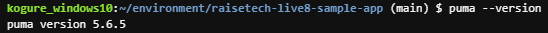
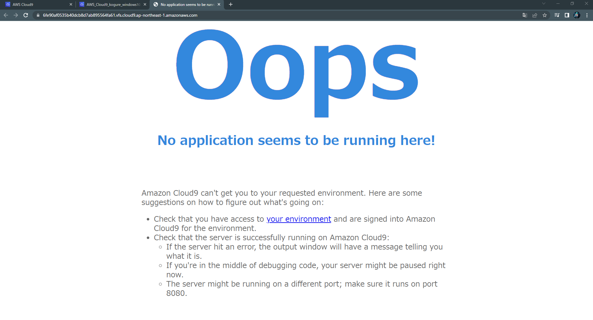
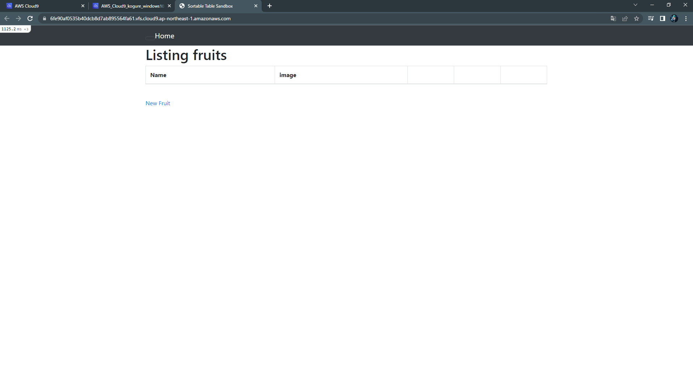
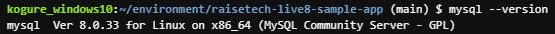
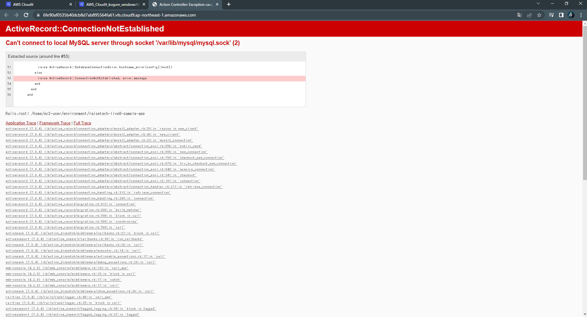

# 第3回課題

## AP サーバーについて
- 名前 : puma
- バージョン : 5.6.5
- AP サーバーを終了させた後のアクセス : 不可
- AP サーバーを再度起動させた後のアクセス : 可
  
  
  
  

  
  
## DB サーバーについて
- 名前 : mysql
- バージョン : 8.0.33
- DB サーバーを終了させた後のアクセス : 不可

  
  
  

## Railsの構成管理ツールの名前
- bundler (version : 3.2.14)

## 今回の課題から学んだこと
- MySQLについて
   * ログイン確認 : mysql -u root -p
   * 起動/停止 : sudo service mysql start/stop

- Bundler(構成管理ツール)によるGem(外部ライブラリ)のインストール方法
   Gemfileにリスト化したgemを一括インストール bundle install --path vendor/bundle

- アプリケーションのデプロイ方法
   * database.yml.sampleをコピーしてdatabase.ymlを作り、password,socketを編集
   * development.rbファイルにconfig.hostsを記入
   * 環境構築 bin/setup
   * AP サーバーの起動 bin/cloud9_dev