# 第5回課題
第4回課題で構築した VPC 、サブネット、AZ 、EC2 、RDS の構成を引き継いで構成した。
## 実行環境の用意
第3回課題のサンプルアプリケーションを稼働させるための環境を用意した。
### サンプルアプリケーションの動作環境
``````
ruby	3.1.2
Bundler	2.3.14
Rails	7.0.4
Node	17.9.1
yarn	1.22.19
``````


``````
# パッケージをアップデート
$ sudo yum -y update

# 必要なパッケージをインストール
$ sudo yum -y install git make gcc-c++ patch curl openssl-devel libcurl-devel libyaml-devel libffi-devel libicu-devel libxml2 libxslt libxml2-devel libxslt-devel zlib-devel readline-devel mysql mysql-server mysql-devel ImageMagick ImageMagick-devel 

# nvmをインストール
$ curl -o- https://raw.githubusercontent.com/nvm-sh/nvm/v0.39.3/install.sh | bash

# nvmを有効化
$ . ~/.nvm/nvm.sh

# node.jsのインストール
$ nvm install 17.9.1

# yarnをインストール
$ npm install -g yarn

# rbenvをインストール
$ git clone https://github.com/sstephenson/rbenv.git ~/.rbenv
$ echo 'export PATH="$HOME/.rbenv/bin:$PATH"' >> ~/.bash_profile
$ echo 'eval "$(rbenv init -)"' >> ~/.bash_profile

# 起動したシェルで、変更したPATHを有効にするため
$ exec $SHELL --login

# rbenvプラグインとしてruby-buildをインストール
$ git clone https://github.com/sstephenson/ruby-build.git ~/.rbenv/plugins/ruby-build

# ruby(3.1.2)をインストール
$ rbenv install 3.1.2
$ rbenv global 3.1.2

# rails(7.0.4)をインストール
$ gem install rails -v 7.0.4

# bundler(2.3.14)をインストール
$ gem install bundler -v 2.3.14
``````

### サンプルアプリケーションのクローン
``````
$ sudo mkdir /var/www
# /var/www とそのコンテンツのグループ所有権を ec2-user グループに変更
$ sudo chown ec2-user:ec2-user /var/www
$ cd /var/www
$ git clone https://github.com/yuta-ushijima/raisetech-live8-sample-app.git
``````
### database.yml の設定
``````
$ cd raisetech-live8-sample-app/config/
$ cp database.yml.sample database.yml

default: &default
   adapter: mysql2
   encoding: utf8mb4
   pool: <%= ENV.fetch("RAILS_MAX_THREADS") { 5 } %>
   username: 設定したユーザ名
   password: 設定したパスワード
   host: RDSのエンドポイント 
``````

### mysqlクライアントのインストール
``````
# mariadbが存在するか確認し削除
$ yum list installed | grep mariadb
$ sudo yum remove mariadb-libs

# mysql8.0 がインストールできるか確認する
$ yum info mysql

# mysql8.0 のリポジトリを追加
$ sudo yum localinstall -y https://dev.mysql.com/get/mysql80-community-release-el7-9.noarch.rpm

# mysql5.7 のリポジトリを無効化し、mysql8.0 のリポジトリを有効化
$ sudo yum-config-manager --disable mysql57-community
$ sudo yum-config-manager --enable mysql80-community

# mysql クライアントをインストール
$ sudo yum install -y mysql-community-client
$ sudo yum install -y mysql-community-devel
``````

## 組み込みサーバ ( puma ) だけで rails アプリ起動

- サンプルアプリケーションの起動
``````
$ bin/setup
$ bin/dev
``````
- EC2 のセキュリティグループに3000番ポートを許可するルールを追加

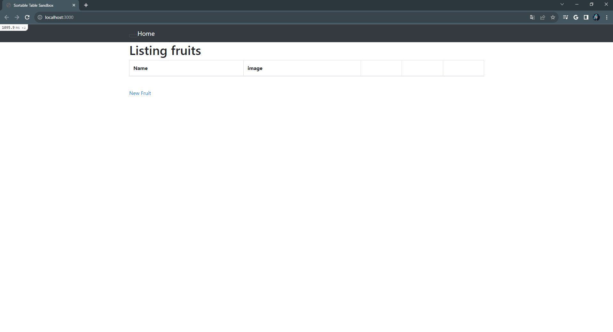

## Unicorn と Nginx の設定
``````
# Nginx をインストール
$ sudo amazon-linux-extras install nginx1

# Unicorn は既にインストール済み ( https://zenn.dev/noraworld/articles/deploy-rails-application-with-nginx-and-unicorn )
# Gemfileのgem 'puma'をコメント化

# unicorn.rb の編集 
$ vi /raisetech-live8-sample-app/config/unicorn.rb

# Unicorn の起動・停止スクリプトを作成
$ rails g task unicorn
$ vi /lib/tasks/unicorn.rake
# Unicornを起動
$ rake unicorn:start

# Nginx の設定ファイルを編集
$ sudo vi /etc/nginx/nginx.conf 
# upstream 内の server のパスは /home/{ユーザ名}/{Railsアプリケーション名}/tmp/unicorn.sock
# server 内の root は /home/{ユーザ名}/{Rails アプリケーション名}/public
# server 内の server_name は使用するサーバのドメイン名もしくはIPアドレス

# ファイル編集後、nginx を再起動
$ sudo systemctl reload nginx
$ sudo systemctl restart nginx
$ sudo systemctl status nginx    # active(running)と表示されればok
``````
#### unicorn.rb
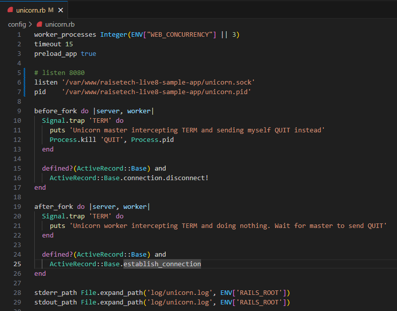

#### nginx.conf
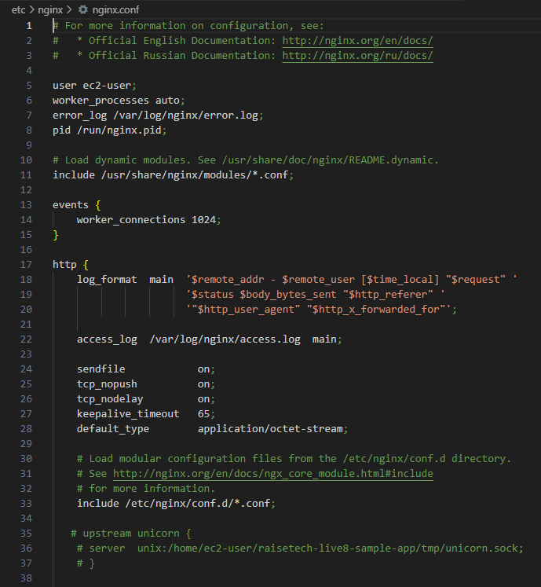
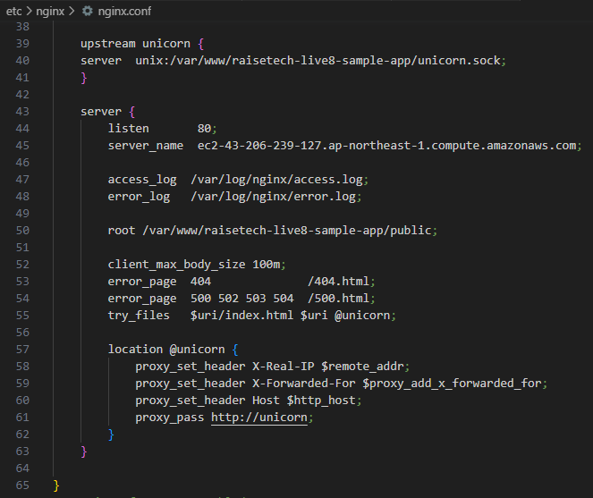

## Unicorn + Nginx で rails アプリを起動
`unicorn.rb` の `listen` の箇所をポート8080にしてみて、これに伴いEC2のセキュリティグループのインバウンドルールでポート8080を開放した。

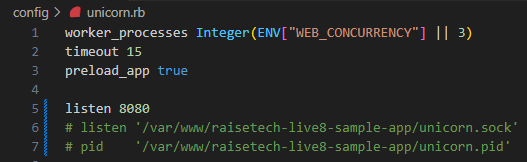
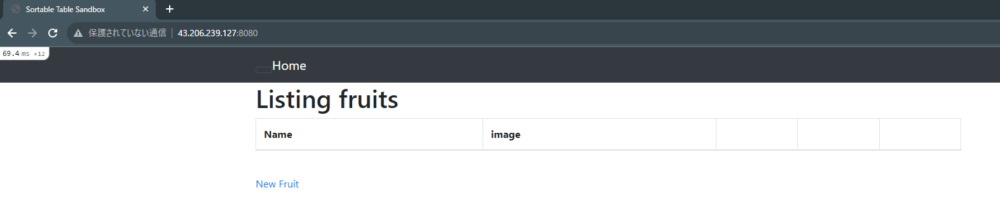

## ALB 適用
少なくとも 2 つ以上のアベイラビリティーゾーンを有効にする必要があるが、対象のインスタンスは1つでも設定できる。

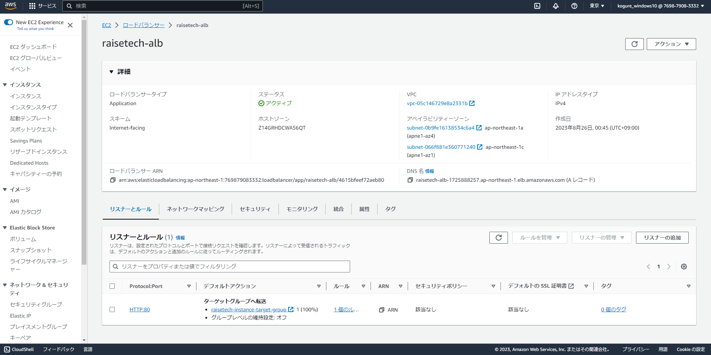

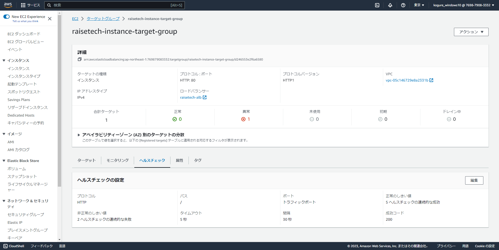

## DNS から rails アプリへアクセス

- デプロイ後、 DNS をブラウザで叩くと `Blocked host:` と表示されたため、`config.hosts << "ALB の DNS アドレス"` を `development.rb` に追記した。
- Unicorn の再起動
  ```
  $ ps -ef | grep unicorn | grep -v grep   # 起動確認
  $ kill -9 トップの番号                    
  $ ps -ef | grep unicorn | grep -v grep   # 停止確認
  $ rake unicorn:start                     # Unicorn 起動
  ```
- Nginx の再起動
  ```
  $ sudo systemctl reload nginx
  $ sudo systemctl restart nginx
  ```
  
  その後、ブラウザで DNS を叩くと問題なく表示された。
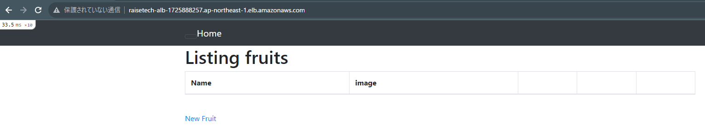


## S3 の追加
- S3 バケットを作成する
- Amazon S3 へのアクセスを許可する IAM インスタンスプロファイル ( IAM ロール ) を作成する
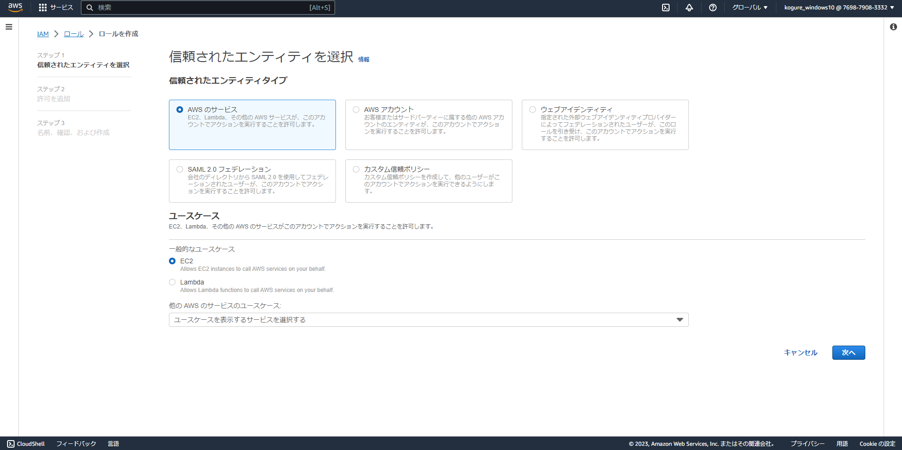
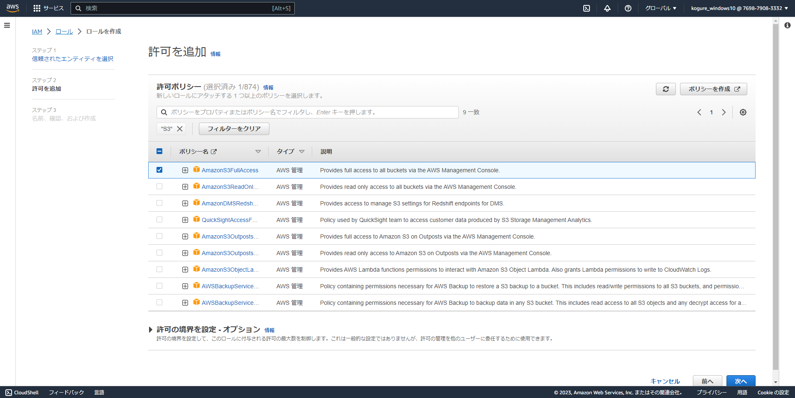
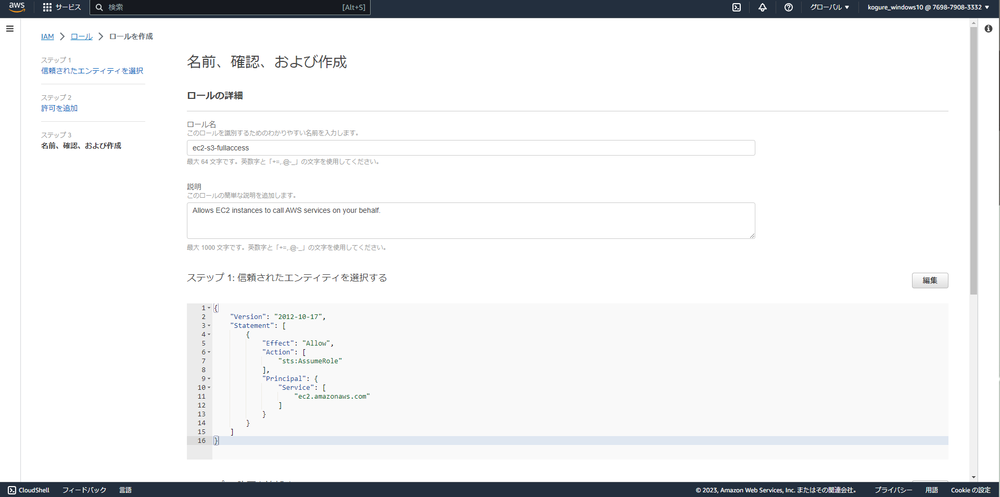
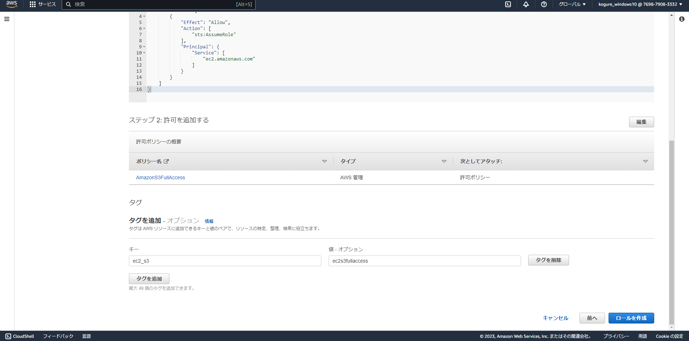

- IAM インスタンスプロファイル ( IAM ロール ) を EC2 インスタンスにアタッチする
- ActiveStorageのストレージをAmazon S3へ向ける
  * `config/environments/development.rb` の `config.active.storage.service` に `:amazon` を指定する。
  * `config/storage.yml` に `region` 、 `bucket` を記述し、 `access_key_id` と `secret_access_key` はコメントアウトする。 ( IAM ロールはアクセスキーとシークレットキーを不要とするため。 )  

  #### development.rb
  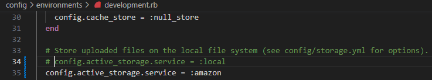

  #### storage.yml
  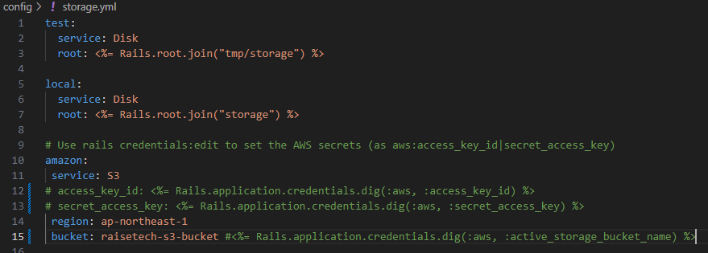

- S3 バケットへのアクセスを検証する
  * 接続確認

  `aws configure list`

  `aws s3 ls`

  

  * 動作確認
  
  ( 1 ) EC2 上からファイルを削除したり、追加した際にS3 のバケットに反映されているかどうか

  

  ( 2 ) S3 側で削除したり追加したものが EC2 に反映さ
れているかどうか

  
  

  
  

## 環境の構成図


## 参考記事
- [【CentOS 7】Nginx + Unicorn で Rails アプリケーションを本番環境で立ち上げる方法](https://zenn.dev/noraworld/articles/deploy-rails-application-with-nginx-and-unicorn)
- [【AWS EC2】Amazon Linux2にnginxをインストールする方法](https://qiita.com/tamorieeeen/items/07743216a3662cfca890)
- [Rakefileにunicorn起動・停止のコマンドを追加する](https://qiita.com/teitei_tk/items/2f997d1b916905da6c80)
- [Amazon S3 バケットへのアクセス権を Amazon EC2 インスタンスに付与するにはどうすればよいですか?](https://repost.aws/ja/knowledge-center/ec2-instance-access-s3-bucket)
- [AWS CLIでS3操作(ls,mb,rb,cp,mv,rm,sync)](https://www.wakuwakubank.com/posts/642-aws-cli-s3/#index_id10)
- [EC2インスタンスからS3バケットにアクセスして、ファイルのダウンロードやアップロードをする](https://qiita.com/If_it_bleeds-we_can_kill_it/items/8ae4ff1020a2ae03225c)
- [AWS の構成図 (アーキテクチャ図) をサクッと描いてみる](https://zenn.dev/tmasuyama1114/articles/28622a52a256ef)