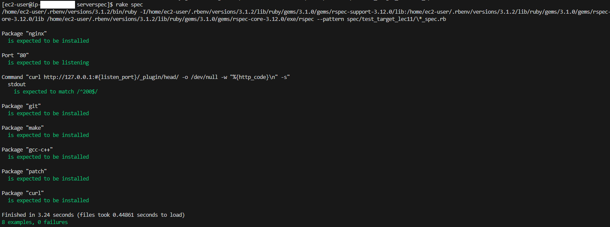

# 第11回課題
## ServerSpec のテストが成功することを追加課題とします。
### 実施内容
### ServerSpec の導入
```
$ gem install serverspec  
$ mkdir serverspec  
$ cd serverspec 

# /home/ec2-user/serverspec/ に ServerSpec をインストール
$ serverspec-init

Select OS type:

  1) UN*X
  2) Windows       

Select number: 1                           # 1 を入力

Select a backend type:

  1) SSH
  2) Exec (local)

Select number: 1                           # 1 を入力

Vagrant instance y/n: n                    # n を入力

Input target host name: test_target_lec11    # テストするサーバのホスト名(ディレクトリ名)を入力
```
`/home/ec2-user/serverspec` 下にディレクトリ、ファイルが自動作成される。
```
severspec/
├─ spec
│  ├─ test_target_lec11
│  │  └─ sample_spec.rb
│  └─ spec_helper.rb
├─ Rakefile
└─ .rspec
```
---
### SSH接続
- 新しい公開鍵の作成  
  `ssh-keygen -y -f ~/.ssh/id_rsa > ~/.ssh/id_rsa.pub` で公開鍵を作成し、 `~/ssh./authorized_keys` に作成した公開鍵をコピペ。

- `~/.ssh/config` に Host を追加
```
Host "test_target_lec11"     # Input target host name: で入力したディレクリ名                        
    Hostname "***"           # IP を指定
    User "ec2-user"
    IdentityFile "~/.ssh/id_rsa"
```
- `~/.ssh/config` の Host で指定した名前を使用して `ssh test_target_lec11` で SSH 接続
---
### ServerSpec テスト
自動作成された `sample_spec.rb` を配布されたサンプルに置換して、編集  
  - `listen_port` は 80 とした。
  - テスト項目を 1 つ追加した。
```rb
require 'spec_helper'

listen_port = 80

# nginx パッケージがインストールされているか確認
describe package('nginx') do
  it { should be_installed }
end

# listen port で指定したポートを Listen しているか確認する
describe port(listen_port) do
  it { should be_listening }
end

# curl で HTTP アクセスして 200 OK が返ってくるか確認する
describe command('curl http://127.0.0.1:#{listen_port}/_plugin/head/ -o /dev/null -w "%{http_code}\n" -s') do
  its(:stdout) { should match /^200$/ }
end

# 複数のパッケージがインストールされているかまとめて確認する
%w{git make gcc-c++ patch curl}.each do |pkg|  
  describe package(pkg) do
    it { should be_installed }
  end
end
```
`rake spec` でテスト実行
### 実行結果

---
### 参考
- [Serverspecの導入とテストの書き方](https://qiita.com/oh_4shiki/items/9439249781b5557a19b6)
- [秘密鍵から公開鍵作る](https://qiita.com/koudaiii/items/45f9f5929afb0039ffdb)
- [~/.ssh/configを使ってSSH接続を楽にする](https://tech-blog.rakus.co.jp/entry/20210512/ssh)
- [Serverspecでよく使うテストの書き方まとめ](https://qiita.com/minamijoyo/items/467ddd13c0cab15330bf)
