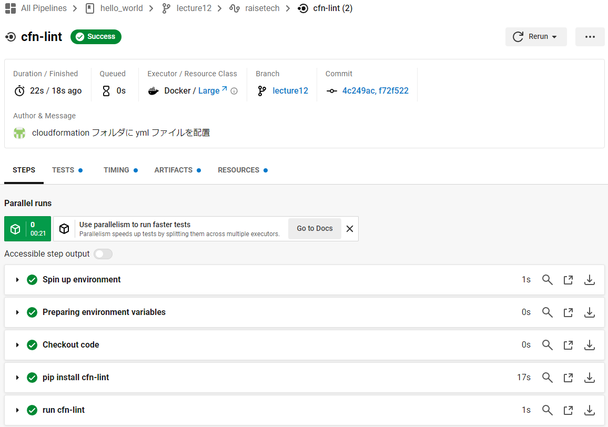

# 第12回課題
## CircleCI のサンプルコンフィグを提供しますので、これが正しく動作するようにリポジトリに組み込んでください。
### 実施内容
- Sign Up with GitHub で CircleCI に登録。
- CircleCI のスタートガイド通りに操作して動作について理解する。
- リポジトリ直下の `.circleci/config.yml` を配布されたサンプルコンフィグに書き換える。
- リポジトリ直下の `cloudformation` フォルダに第 10 回課題で作成した yml ファイルを配置。
- コミット、プッシュして CircleCI で job ( サンプルコンフィグが動作しているか ) を確認。  

#### `.circleci/config.yml`
```yml
version: 2.1
orbs:
  python: circleci/python@2.0.3
jobs:
  cfn-lint:
    executor: python/default
    steps:
      - checkout
      - run: pip install cfn-lint
      - run:
          name: run cfn-lint
          command: |
            cfn-lint -i W3002 -t cloudformation/*.yml

workflows:
  raisetech:
    jobs:
      - cfn-lint
```
---
### 結果
サンプルコンフィグが正しく動作した。


---
### 参考
- [CircleCI ドキュメント / スタートガイド](https://circleci.com/docs/ja/getting-started/)